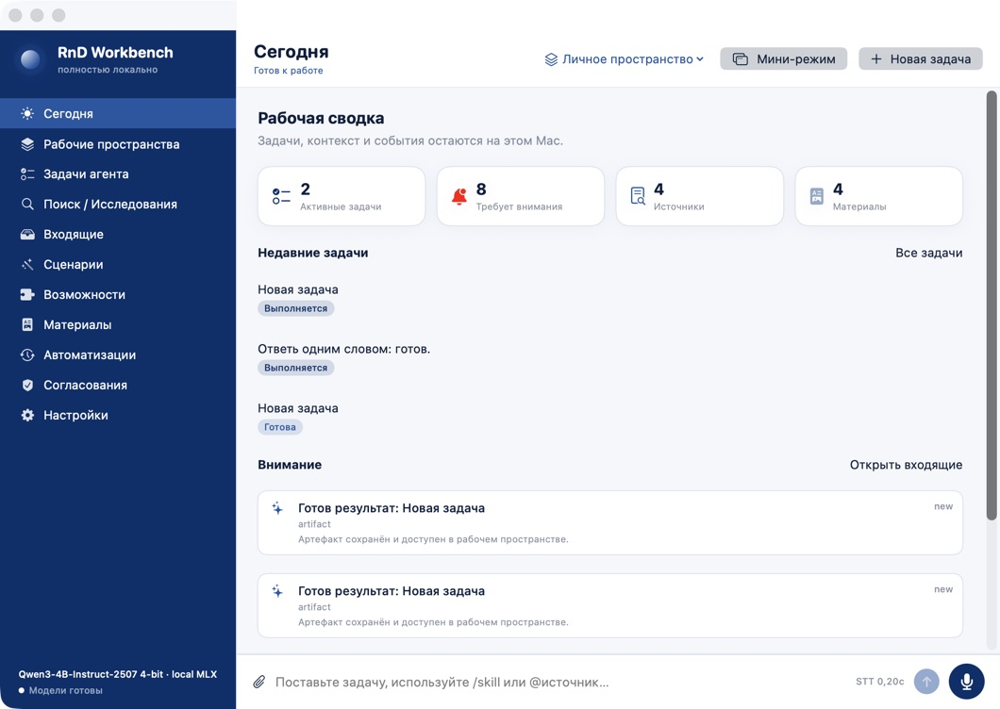
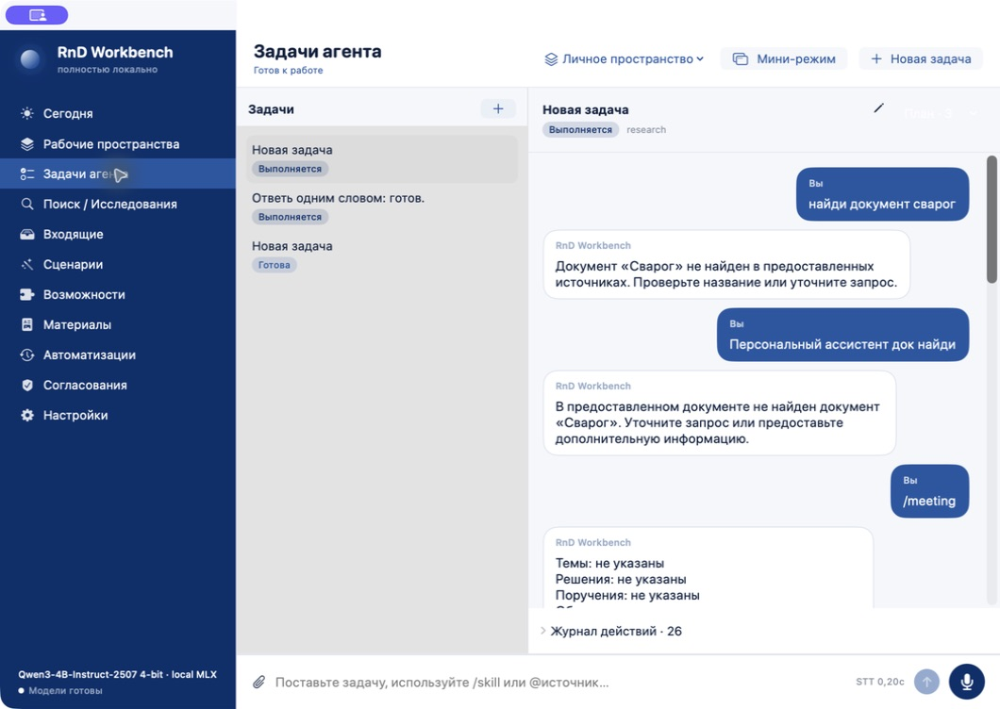
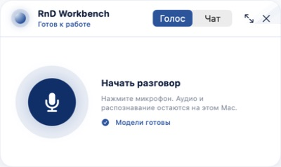
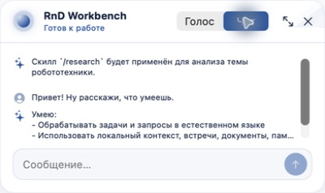
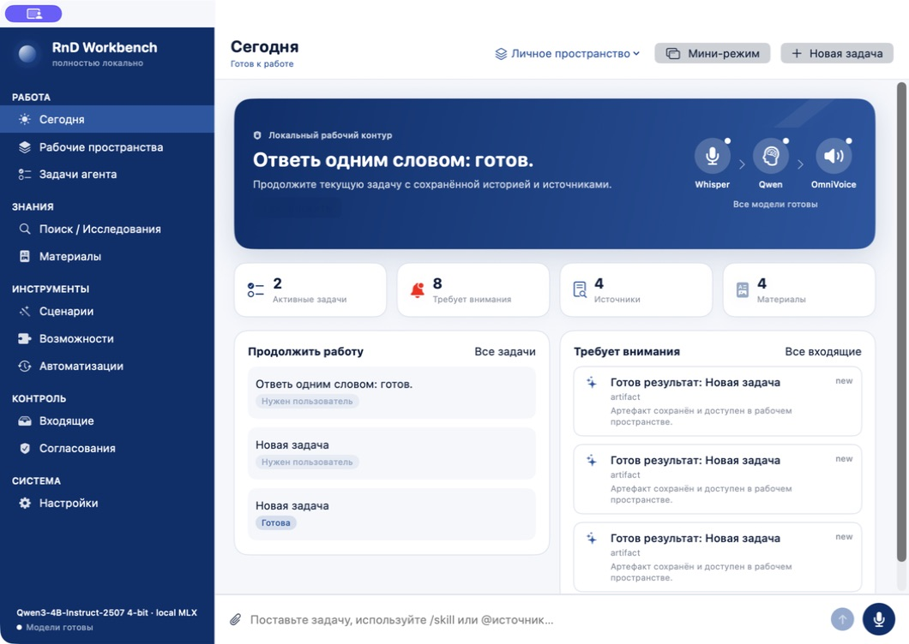
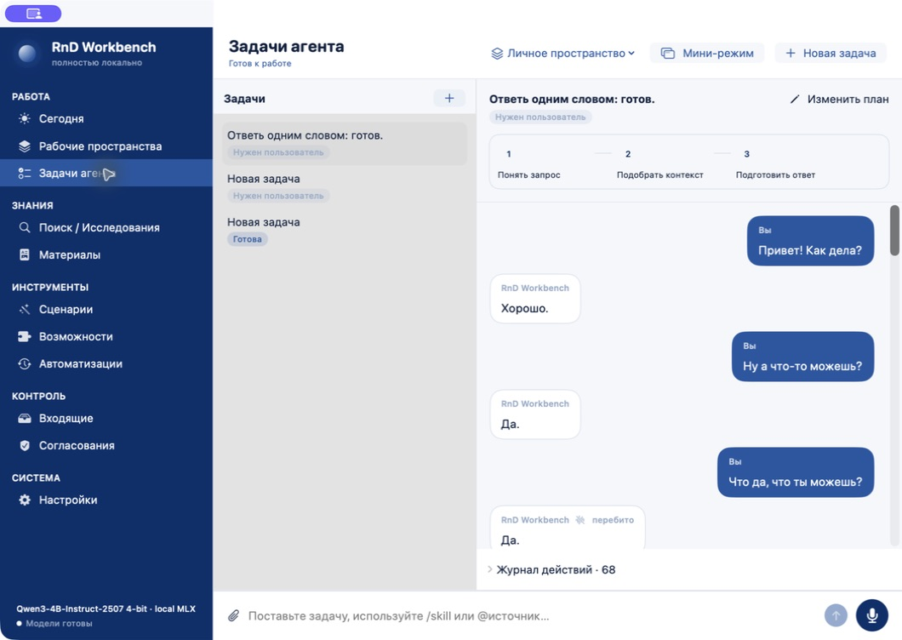
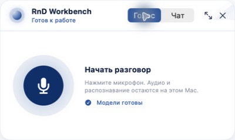
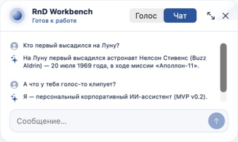

# UX-аудит RnD Workbench

Дата: 2026-08-30  
Поверхность: нативное macOS-приложение, основное и компактное окна.  
Цель пользователя: быстро поставить рабочую задачу голосом или текстом, видеть контекст и продолжить работу без настройки моделей и инструментов.

## Шаг 1. Сегодня — состояние требует упрощения

Сильные стороны: понятная локальность, хорошо заметны новая задача и микрофон, бренд-палитра последовательна.

Риски: 11 равноправных пунктов навигации создают высокую стоимость выбора; четыре метрики, список задач и Inbox визуально выглядят одинаково; верхняя часть не объясняет основной pipeline и не даёт одного очевидного продолжения работы. Несколько одинаковых карточек Inbox плохо сканируются.

Решение: сгруппировать навигацию в «Работа», «Знания», «Инструменты», «Контроль» и «Система» без удаления обязательных разделов; добавить визуальный hero «Локальный рабочий контур» с состояниями Whisper → Qwen → OmniVoice; объединить недавние задачи и внимание в две компактные панели.

## Шаг 2. Задача — функционально сильный, визуально плотный

Сильные стороны: контекст задач изолирован, история читается как диалог, статус и skill видимы, журнал действий доступен без показа скрытых рассуждений.

Риски: план спрятан в меню и почти не помогает ориентироваться; длинные ответы занимают всю ширину и плохо связываются с источниками; серый список задач и белая беседа образуют слабую иерархию. Две задачи после перебивания визуально остаются «Выполняется».

Решение: вынести этапы плана в компактную графическую ленту; хранить источники у конкретного ответа и показывать открываемыми chips; исправлять terminal status при interrupt/error.

## Шаг 3. Компактный голос — хороший основной сценарий

Сильные стороны: один крупный CTA, ясный выбор «Голос / Чат», локальность объяснена, целевой размер управления достаточен.

Риски: состояние готовности TTS неотличимо от готовности всего pipeline; при ложном self-barge-in пользователь видит готовый интерфейс, но не понимает, почему звук остановился.

Решение: сохранить структуру, но усилить echo guard и показывать различимое состояние «Озвучиваю / Перебито / Ошибка аудиовыхода».

## Шаг 4. Компактный чат — перегружен длинными ответами

Сильные стороны: чат действительно помещается в угол и сохраняет историю.

Риски: длинный Markdown обрезается небольшим viewport; нет быстрого перехода к полной задаче именно из сообщения; визуально слабо различаются результат, источник и системное состояние.

Решение: в compact показывать короткий preview последних сообщений, а подробный результат оставлять полному окну; источники показывать компактными кнопками.

## Приоритеты

1. P0 — устранить ложное self-barge-in и явные зависшие статусы.
2. P0 — task-only вложения и открываемые источники у каждого ответа.
3. P1 — сгруппированная навигация, hero локального pipeline и видимый план задачи.
4. P1 — actionable Today/Inbox и короткий compact preview.

## Доступность и границы доказательств

По скриншотам видны хорошие крупные основные кнопки и текстовые подписи у большинства элементов. Возможные риски: мелкий серый вспомогательный текст, слабый контраст неактивных статусов, reliance на цвет для некоторых состояний и длинные прокручиваемые области. Клавиатурную навигацию, VoiceOver-порядок, Dynamic Type, Reduce Motion и численный контраст скриншоты не доказывают — нужны отдельные системные проверки.

## Результат v0.6.0

### Шаг 1. Сегодня — исправлено, состояние здоровое

Навигация сгруппирована, появился один главный путь продолжения, визуальный
pipeline показывает готовность Whisper, Qwen и OmniVoice, а задачи и внимание
разделены на две сканируемые панели.

### Шаг 2. Задача — исправлено, состояние здоровое

План постоянно виден. После восстановления старые зависшие задачи получили
статус «Нужен пользователь», завершённые этапы имеют текст и checkmark.
Источники ответа доступны отдельными открываемыми кнопками.

### Шаг 3. Компактный голос — без регрессий, состояние здоровое

Один основной CTA сохранён; готовность моделей подписана текстом. Исправление
echo guard не изменило компоновку и доступность управления.

### Шаг 4. Компактный чат — упрощён, состояние здоровое с ограничением

Показываются последние четыре сообщения с трёхстрочным preview. Подробный ответ
по-прежнему лучше читать в полном окне; это осознанное ограничение углового
виджета, а не попытка уместить весь task UI в 400 × 238.
